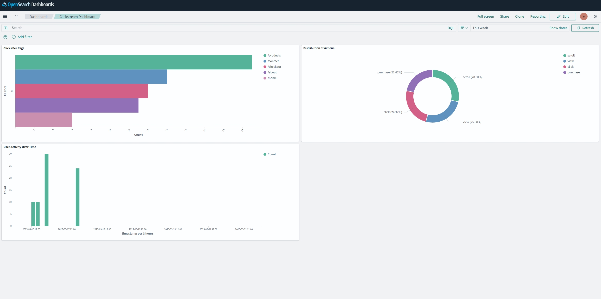

# Aiven Demo: Real-Time Clickstream Data Pipeline

This project demonstrates a real-time data pipeline using Aiven Kafka for data ingestion and Aiven OpenSearch for data storage and analytics. The pipeline simulates website clickstream data, ingests it into Kafka, and then pushes it to OpenSearch for visualization and analysis.

## Table of Contents
- [Project Overview](#project-overview)
- [Features](#features)
- [Prerequisites](#prerequisites)
- [Setup Instructions](#setup-instructions)
  - [Clone the Repository](#clone-the-repository)
  - [Set Up Aiven Services](#set-up-aiven-services)
  - [Configure the Project](#configure-the-project)
  - [Run the Application](#run-the-application)
- [Project Structure](#project-structure)
- [Configuration](#configuration)
- [Usage](#usage)
  - [Producing Clickstream Data](#producing-clickstream-data)
  - [Consuming Clickstream Data](#consuming-clickstream-data)
  - [Visualizing Data in OpenSearch Dashboards](#visualizing-data-in-opensearch-dashboards)

## Project Overview

This project is a Go-based implementation of a real-time data pipeline that:

- Produces simulated clickstream data (e.g., user actions like clicks, views, and scrolls) and sends it to Aiven Kafka.
- Consumes the clickstream data from Kafka and indexes it into Aiven OpenSearch.
- Visualizes the data using OpenSearch Dashboards for analytics and monitoring.

## Features

- **Real-Time Data Ingestion**: Simulates website clickstream data and ingests it into Kafka.
- **Data Storage**: Stores clickstream data in OpenSearch for real-time analytics.
- **Scalable and Secure**: Uses Aiven's managed Kafka and OpenSearch services for scalability and security.
- **Visualization**: Provides dashboards for visualizing clickstream data in OpenSearch Dashboards.

## Prerequisites

Before running the project, ensure you have the following:

- **Go** (version 1.20 or higher) installed on your machine.
- **Aiven Account**: Sign up at [Aiven](https://aiven.io/).
- **Aiven Services**:
  - Aiven Kafka (for data ingestion).
  - Aiven OpenSearch (for data storage and visualization).
- **TLS Certificates**: Download the TLS certificates (ca.pem, service.cert, service.key) from your Aiven Kafka service.

## Setup Instructions

### 1. Clone the Repository

```bash
git clone https://github.com/Douglas-Young/aivendemo.git
cd aivendemo
```

### 2. Set Up Aiven Services

#### Create Aiven Kafka and OpenSearch Services:
- Log in to your Aiven account.
- Create a Kafka service and an OpenSearch service.
- Download the TLS certificates (ca.pem, service.cert, service.key) for both services.

#### Create Kafka Topic:
- Create a Kafka topic named `clickstream` in your Aiven Kafka service.

### 3. Configure the Project

#### Create `config.yaml` from the Example File:

Since `config.yaml` contains sensitive information, it is **not included in the repository**. Instead, use the provided `config.example.yaml` as a template:

```bash
cp config.example.yaml config.yaml
```

#### Update `config.yaml`:

Replace the placeholders in `config.yaml` with your Aiven service details and file paths.

```yaml
kafka:
  brokers:
    - "your-kafka-broker:9092"
  topic: "<topic_name>"
  consumer_group: "<topic consumer group>"
  tls_cert: "./certs/service.cert"
  tls_key: "./certs/service.key"
  tls_ca: "./certs/ca.pem"

opensearch:
  url: "<opensearch_url>"
  user: "<admin>"
  password: "<password>"
  index: "<index>"
```

#### Place TLS Certificates:
- Place the TLS certificates (`ca.pem`, `service.cert`, `service.key`) in the `certs/` directory.

### 4. Run the Application

#### Install Dependencies:
```bash
go mod tidy
```

#### Run the Application:
```bash
go run src/cmd/main.go
```

## Project Structure

```
aivendemo/
├── certs/                     # TLS certificates for Kafka and OpenSearch (not included in repo)
├── src/
│   ├── cmd/                   # Main application entry point
│   │   ├── main.go
│   ├── internal/              # Internal application logic
│   │   ├── config.go          # Configuration loading
│   │   ├── consumer.go        # Kafka consumer
│   │   ├── models.go          # Data models
│   │   ├── producer.go        # Kafka producer
├── config.example.yaml        # Example configuration file
├── go.mod                     # Go module file
├── go.sum                     # Go dependencies checksum file
└── README.md                  # Project documentation
```

## Configuration

The `config.yaml` file contains all the necessary configuration for the application. Since it includes sensitive credentials, it is **excluded from version control**. Use `config.example.yaml` as a template.

## Usage

### Producing Clickstream Data

The `ProduceKafkaMessages` function in `internal/producer.go` generates simulated clickstream data and sends it to the Kafka topic `clickstream`.

### Consuming Clickstream Data

The `ConsumeKafkaMessages` function in `internal/consumer.go` consumes messages from the Kafka topic `clickstream` and indexes them into OpenSearch.

### Visualizing Data in OpenSearch Dashboards

#### Create an Index Pattern:
- Go to **OpenSearch Dashboards**.
- Navigate to **Stack Management > Index Patterns**.
- Create an index pattern for `clickstream`.

#### Build Visualizations And Dashboard:
To visualize clickstream data, an OpenSearch Dashboard has been created with the following key insights:  

- **Clicks Per Page**: A bar chart displaying the most visited pages based on user clicks.  
- **Distribution of Actions**: A donut chart showing the proportion of different user actions (click, view, scroll, purchase).  
- **User Activity Over Time**: A time-series chart tracking user activity trends over different time intervals.  

These visualizations provide valuable insights into user behavior, helping to analyze engagement patterns and interactions across the website. You can further customize the dashboard by adding filters, changing time ranges, and refining queries to focus on specific events.  

### Dashboard Preview  

  


